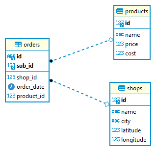
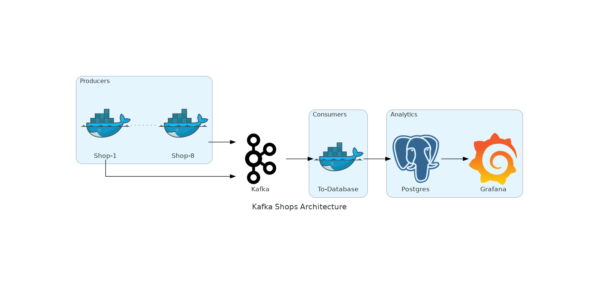
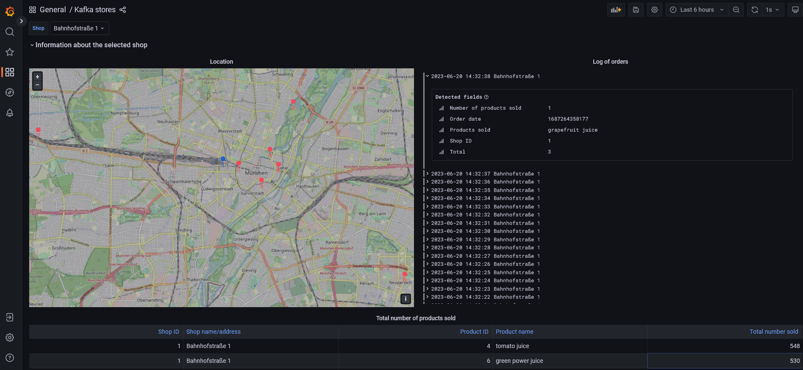

<div id="top"></div>

<br />
<h2 align="center">Kafka-Postgres-Grafana-Data-Pipeline</h2>
<br />
</div>


1. [About the Project](#about-the-project)
2. [Build with](#build-with)
3. [Usage](#usage)
4. [Contact](#contact)
<br />


### About the Project <a id="about-the-project"></a>
This project demonstrates a simple data pipeline with Kafka, Postgres and Grafana.

<p align="right">(<a href="#top">back to top</a>)</p>


### Built with <a id="build-with"></a>
The project was built with **Python 3.10.7** and **Docker version 20.10.18**.
The python requirements are listed in **requirements.txt**.

The main requirements are the following:

* [python](https://www.python.org/)
* [docker](https://www.docker.com/)
* [kafka](https://kafka.apache.org/)
* [postgres](https://www.postgresql.org/)
* [grafana](https://grafana.com/)

<p align="right">(<a href="#top">back to top</a>)</p>


### Usage <a id="usage"></a>
The Kafka UI can be accessed via [localhost:8080](localhost:8080). The Grafana data dashboard is available on [localhost:3000](localhost:3000).

1. Clone the repository
    ```sh
    git clone https://github.com/SimonReitzner/kafka-postgres-grafana-data-pipeline
    ```
2. Start kafka, postgres and grafana
    ```sh
    docker-compose up -d
    ```
    The database already contains metadata at startup:
    
3. Build the docker images for the producer and consumer
    ```sh
    ./main.sh producer build
    ./main.sh consumer build
    ```
4. Start the producers (max. 8)
    ```sh
    ./main.sh producer up 8
    ```
    The producers create artifical json data that is pushed to the kafka instance, e.g.:
    ```json
    {
        "id": "8d5c88070a043783fbbd6d6ede51fbf2fdcf5941e622fb10dafa91f2f5d0dba6",
        "shop_id": "1",
        "products": [
            9,
            8,
            14,
            11,
            13
        ]
    }
    ```
    You can monitor kafka through the ui.
5. Start the consumer
    ```
    ./main.sh consumer up
    ```



<p align="right">(<a href="#top">back to top</a>)</p>


### Contact <a id="contact"></a>
Project Link: [Kafka-Postgres-Grafana-Data-Pipeline](https://github.com/SimonReitzner/kafka-postgres-grafana-data-pipeline)

<p align="right">(<a href="#top">back to top</a>)</p>
